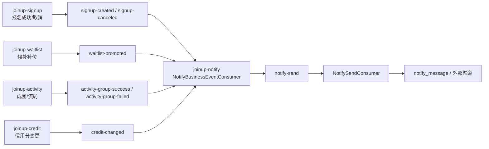
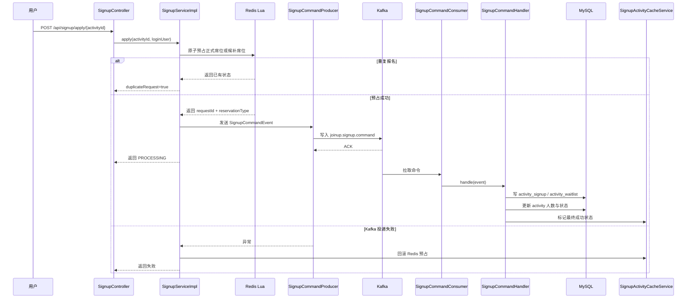
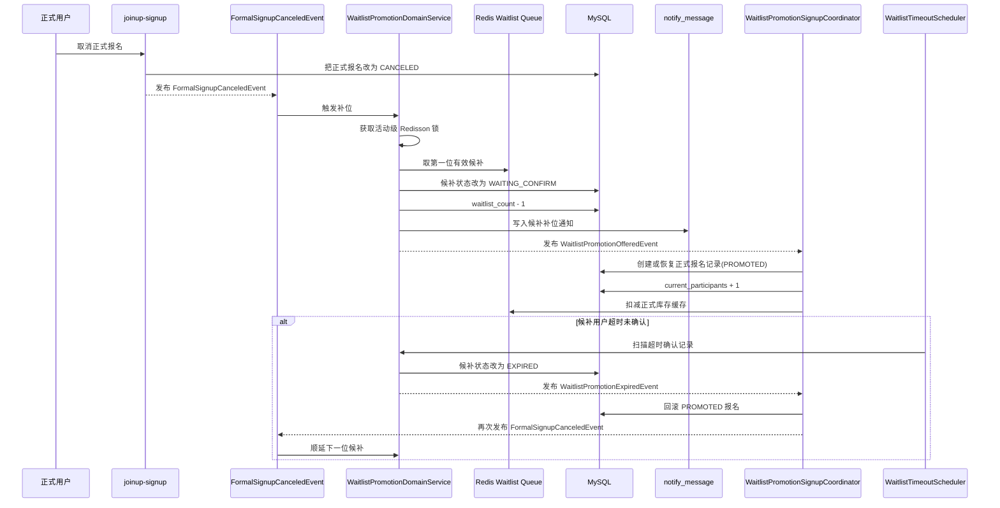
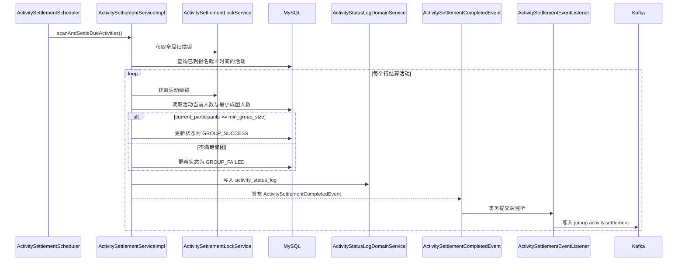

# 第12段：项目收口与迭代底稿

## 本段目标
对 JoinUp 项目做最后一轮工程化收口，输出 Redis Key 汇总、Kafka 事件链路、核心时序图、测试建议、接口文档组织建议、README 初稿与后续演进方向，帮助后续继续迭代而不是停留在“阶段性交付”。

## 1. Redis Key 设计汇总

### 1.1 平台层统一 Key 约定
本段新增了公共 Key 入口：[JoinUpRedisKeys.java](/C:/JoinUp/joinup-common/src/main/java/com/joinup/common/constants/JoinUpRedisKeys.java)

| Key | Redis 结构 | 推荐值设计 | 主要写入方 | 主要读取方 | 过期建议 | 说明 |
|---|---|---|---|---|---|---|
| `joinup:activity:stock:{activityId}` | `String` | 剩余正式名额整数值 | `joinup-signup` | `joinup-signup`、运维脚本 | 活动结束后 `+1d` | 高并发报名最核心热点 Key |
| `joinup:activity:waitlist:{activityId}` | `ZSet` | member=`userId`，score=`queueNo` | `joinup-waitlist` | `joinup-waitlist`、后台监控 | 活动结束后 `+1d` | 候补先到先得的直接载体 |
| `joinup:signup:dedup:{activityId}:{userId}` | `String/Hash` | 最近一次请求号、状态快照 | `joinup-signup` | `joinup-signup` | 活动结束后 `+1d` | 幂等、重复点击防护 |
| `joinup:lock:activity:{activityId}` | `RLock` | 锁本身无业务值 | `joinup-signup`、`joinup-waitlist`、`joinup-activity` | 同上 | 秒级 lease | 通用活动级互斥锁入口 |
| `joinup:rank:activity:hot` | `ZSet` | member=`activityId`，score=`heatScore` | `joinup-activity`、后续统计任务 | 首页、后台监控 | 长期保留 | 热门活动榜 |
| `joinup:rank:tag:hot` | `ZSet` | member=`tag`，score=`heatScore` | `joinup-activity`、后续统计任务 | 首页、推荐、搜索 | 长期保留 | 热门标签榜 |
| `joinup:rate_limit:user:{userId}` | `String/Hash` | 窗口计数或令牌桶状态 | 网关层 / `joinup-boot` / 业务模块 | 限流拦截器 | 秒级到分钟级 | 防刷报名、防刷创建、防刷举报 |

### 1.2 当前代码里的细粒度 Key
当前项目已经落地了更细粒度的 Key 工具类，它们和上面的平台层命名不是冲突关系，而是“细化实现”和“统一口径”的关系。

| 已有类 | 当前 Key 示例 | 对应平台层概念 |
|---|---|---|
| [SignupRedisKeys.java](/C:/JoinUp/joinup-signup/src/main/java/com/joinup/signup/support/SignupRedisKeys.java) | `joinup:signup:activity:{activityId}:formal:remain` | `joinup:activity:stock:{activityId}` |
| [SignupRedisKeys.java](/C:/JoinUp/joinup-signup/src/main/java/com/joinup/signup/support/SignupRedisKeys.java) | `joinup:signup:activity:{activityId}:user:{userId}:state` | `joinup:signup:dedup:{activityId}:{userId}` |
| [WaitlistRedisKeys.java](/C:/JoinUp/joinup-waitlist/src/main/java/com/joinup/waitlist/support/WaitlistRedisKeys.java) | `joinup:waitlist:activity:{activityId}:queue` | `joinup:activity:waitlist:{activityId}` |
| [WaitlistRedisKeys.java](/C:/JoinUp/joinup-waitlist/src/main/java/com/joinup/waitlist/support/WaitlistRedisKeys.java) | `joinup:waitlist:activity:{activityId}:promotion:lock` | `joinup:lock:activity:{activityId}` 的候补细分场景 |

### 1.3 实战建议
1. 正式库存、候补队列、幂等状态的 TTL 不要永久保留，建议统一跟活动生命周期走。
2. 排行榜不要在报名链路里同步重算，应该由异步事件或定时任务增量更新。
3. 活动锁要细分语义，通用锁适合跨模块协调，具体业务锁适合热点路径防串扰。
4. 限流 Key 推荐从网关或统一拦截器切入，不要把限流逻辑散在每个 Controller 里。

## 2. Kafka 事件链路汇总

### 2.1 当前已落地的主题与链路
| Topic | 生产方 | 消费方 | 作用 | 当前状态 |
|---|---|---|---|---|
| `joinup.signup.command` | [SignupCommandProducer.java](/C:/JoinUp/joinup-signup/src/main/java/com/joinup/signup/producer/SignupCommandProducer.java) | [SignupCommandConsumer.java](/C:/JoinUp/joinup-signup/src/main/java/com/joinup/signup/consumer/SignupCommandConsumer.java) | 报名/取消命令异步落库 | 已接入 |
| `joinup.activity.settlement` | [ActivitySettlementEventProducer.java](/C:/JoinUp/joinup-activity/src/main/java/com/joinup/activity/producer/ActivitySettlementEventProducer.java) | 下游业务消费者预留 | 成团/流局结算总线 | 已接入主链路 |
| `notify-send` | [NotifySendEventProducer.java](/C:/JoinUp/joinup-notify/src/main/java/com/joinup/notify/producer/NotifySendEventProducer.java) | [NotifySendConsumer.java](/C:/JoinUp/joinup-notify/src/main/java/com/joinup/notify/consumer/NotifySendConsumer.java) | 统一通知发送命令 | 已接入 |

### 2.2 已定义但仍需在上游继续补 Producer 的业务 Topic
这些 Topic 已经在 [NotifyKafkaConstants.java](/C:/JoinUp/joinup-common/src/main/java/com/joinup/common/kafka/NotifyKafkaConstants.java) 中统一定义，并且通知模块的 [NotifyBusinessEventConsumer.java](/C:/JoinUp/joinup-notify/src/main/java/com/joinup/notify/consumer/NotifyBusinessEventConsumer.java) 已经具备消费骨架，但上游业务模块还需要逐步补齐真正的发送动作。

| Topic | 目标业务含义 | 当前消费方 | 当前状态 |
|---|---|---|---|
| `signup-created` | 报名成功通知 | `joinup-notify` | Topic 和消费者已准备，上游发送待补 |
| `signup-canceled` | 报名取消通知 | `joinup-notify` | Topic 和消费者已准备，上游发送待补 |
| `waitlist-promoted` | 候补转正通知 | `joinup-notify` | Topic 和消费者已准备，上游发送待补 |
| `activity-group-success` | 成团通知 | `joinup-notify` | Topic 和消费者已准备，上游发送待补 |
| `activity-group-failed` | 流局通知 | `joinup-notify` | Topic 和消费者已准备，上游发送待补 |
| `credit-changed` | 信用变更通知 | `joinup-notify` | Topic 和消费者已准备，上游发送待补 |

### 2.3 推荐的最终业务链路

### 2.4 实战建议
1. 命令型 Topic 和通知型 Topic 不要混用，前者强调一致性，后者强调业务广播。
2. 所有需要“事务提交后再发消息”的场景，优先走领域事件 + `@TransactionalEventListener(AFTER_COMMIT)`。
3. 后续如果需要更强一致性，可以把关键事件升级成 Outbox 模式。

## 3. 高并发报名时序图说明

### 3.1 关键设计点
1. Redis 预占在前，数据库落库在后，保证热点路径尽量不打到数据库行锁。
2. Lua 脚本承担“库存扣减 + 去重判断 + 候补切换”的原子性。
3. Kafka ACK 没收到就立刻补偿 Redis，避免出现“库存扣了但消息没进队列”。
4. 数据库唯一索引 `activity_id + user_id` 是最终兜底，不依赖 Redis 单点正确性。
5. 查询接口采用“Redis 处理中状态 + 数据库最终状态”双读聚合，兼顾实时性和一致性。

## 4. 候补补位时序图说明

### 4.1 关键设计点
1. 候补补位必须拿活动级锁，否则同一活动在多个取消操作下容易同时推多个人。
2. 候补队列只认“有效状态”，已取消或已失效用户在取队头时要跳过。
3. 候补补位与正式报名数据结构仍然分开，避免候补信息和正式席位混在一张表里。
4. 候补超时后不是直接结束，而是重新触发“正式席位释放事件”，形成顺延闭环。

## 5. 成团/流局任务执行时序说明

### 5.1 关键设计点
1. 先拿全局扫描锁，再拿活动级锁，解决多实例部署下的重复扫描和重复结算问题。
2. 只结算 `SIGNUP_OPEN / FULL / WAITLIST_OPEN`，避免终态活动被再次改写。
3. 报名截止后继续报名的保护不能只放在定时任务里，报名入口本身也要校验截止时间。当前报名链路已经这样做了。
4. 成团后名单锁定，流局后报名与候补都应被下游模块关闭。

## 6. 单元测试建议

### 6.1 优先级最高的单元测试
1. `SignupActivityCacheServiceTest`
   - Lua 预占正式库存成功
   - 正式名额满后自动切候补
   - 同一用户重复点击不重复扣库存
   - Kafka 投递失败后的 Redis 补偿
2. `SignupCommandHandlerTest`
   - 正式报名落库成功
   - 候补报名落库成功
   - 重复消费同一命令时幂等生效
   - 正式取消后人数与状态刷新正确
3. `WaitlistPromotionDomainServiceTest`
   - 正式取消后取第一位候补
   - 无效候补自动跳过
   - 候补超时后顺延下一位
4. `ActivitySettlementRuleTest`
   - 刚好等于最小成团人数时成团
   - 低于最小成团人数时流局
   - 非可结算状态拒绝进入结算
5. `ActivitySettlementServiceImplTest`
   - 成团时写状态日志
   - 流局时发布结算事件
   - 活动级锁防止重复结算
6. `CreditRuleEngineTest`
   - 正常参加加分
   - 提前取消不扣或轻扣
   - 临时取消扣分
   - 爽约重扣并触发限制
7. `NotifyMessageFactoryTest`
   - 不同业务事件生成的消息标题、内容和类型正确

### 6.2 工具建议
1. 纯规则类优先用 `JUnit 5` 直接测，不要每个测试都拉 Spring 容器。
2. 依赖数据库和 Mapper 的服务层用 `Mockito` 隔离外部依赖。
3. 异步等待场景建议引入 `Awaitility`。

## 7. 集成测试建议

### 7.1 推荐使用 Testcontainers
建议直接拉起：
1. MySQL 8
2. Redis
3. Kafka

这样能真正覆盖“缓存、消息、数据库”三者一起工作的链路，而不是只测单个类。

### 7.2 必测场景矩阵
1. 热门活动 `10` 个正式名额，`200` 个并发报名
   - 最终只能有 `10` 个正式报名
   - 不允许超卖
2. 同一用户同时重复点击 `10` 次报名
   - 最终只能生成一条有效记录
3. 正式用户取消后触发候补补位
   - 下一位候补收到补位状态
4. 候补超时未确认
   - 顺延到下一位候补
5. 截止时间到达后自动结算
   - 满足人数成团
   - 不满足人数流局
6. 低信用用户报名热门活动
   - 被拒绝
7. 通知链路端到端
   - 发送业务 topic 消息
   - 最终落 `notify_message`

### 7.3 断言建议
1. 不只断言 HTTP 响应，还要断言 Redis、Kafka 消费结果、数据库终态。
2. 对异步场景不要写死 `sleep`，要用轮询等待最终状态。

## 8. 接口文档组织建议

### 8.1 按模块分组
推荐在 Knife4j / OpenAPI 中按 Tag 分组：
1. `User`
2. `Activity`
3. `Signup`
4. `Waitlist`
5. `Credit`
6. `Notify`
7. `Admin`

### 8.2 每个接口必须写清楚的内容
1. 是否需要登录
2. 是否需要管理员权限
3. 是否是异步接口
4. 幂等语义
5. 可能返回的业务状态码
6. 涉及的状态枚举说明
7. 示例请求与示例响应

### 8.3 对高并发接口的特殊要求
`/api/signup/apply/{activityId}` 这类接口必须额外写清楚：
1. 成功返回 `PROCESSING` 不等于数据库已落库
2. 最终结果需要调用查询接口确认
3. 重复点击会命中幂等保护

### 8.4 推荐的文档目录
1. `接口分组`
2. `认证与鉴权`
3. `通用错误码`
4. `状态枚举总览`
5. `异步链路说明`
6. `回调与通知说明`

## 9. README 初稿
本段已经直接重写根 README，文件位置：

[README.md](/C:/JoinUp/README.md)

新的 README 重点补了这些内容：
1. 项目定位
2. 技术栈
3. 模块划分
4. 核心业务能力
5. 快速启动步骤
6. 文档索引
7. 分段交付记录

## 10. 开发顺序建议
如果后续要继续推进真实可上线版本，建议按下面顺序继续：

1. 先把业务 Topic 的上游 Producer 真正补齐  
   目标：打通 `signup-created / waitlist-promoted / credit-changed / activity-group-*`
2. 补齐集成测试  
   目标：把“高并发报名、候补补位、成团流局、通知链路”测成稳定回归用例
3. 接入正式 RBAC  
   目标：替换现在 `admin` 用户名兜底的临时实现
4. 把后台操作日志升级成切面自动记录  
   目标：减少后台写接口遗漏日志的风险
5. 增加监控与告警  
   目标：关注报名失败率、Kafka 积压、Redis 热点和定时任务异常
6. 优化排行榜与推荐链路  
   目标：把热度、标签、推荐从“预留字段”升级为可用能力

## 11. 后续可扩展能力

### 11.1 WebSocket 实时人数更新
建议放置：
1. 小规模阶段可先放在 `joinup-notify`
2. 如果实时能力变重，建议拆成新模块 `joinup-realtime`

推荐做法：
1. 报名成功、候补补位、取消报名时发布站内实时事件
2. 前端订阅活动房间频道
3. 只推“人数变化”和“状态变化”，不要直接推整张活动详情

### 11.2 AI 活动推荐
建议新建模块：`joinup-recommend`

推荐做法：
1. 输入用户标签、历史参与、时间偏好、地理偏好
2. 结合 `heat_score` 和标签热度做召回
3. AI 只做重排，不直接替代规则层

### 11.3 活动聊天室
建议新建模块：`joinup-chat`

推荐做法：
1. 只对成功报名或已转正用户开放
2. 活动结束后自动归档
3. 消息体不要进入报名主事务

### 11.4 地图位置能力
建议扩展模块：
1. `joinup-activity` 增加经纬度字段
2. `joinup-infra` 接地图服务 SDK

推荐做法：
1. 地点文本和经纬度并存
2. 先支持附近活动检索，再逐步做路线规划

### 11.5 活动海报生成
建议新建模块：`joinup-media`

推荐做法：
1. 活动创建成功后异步生成海报
2. 海报模板不要耦合在活动创建事务里
3. 生成结果可以回写到活动扩展字段或媒体表

## 12. 当前最值得继续补的三件事
1. 业务 Topic 的 Producer 补齐，把通知链路真正打通
2. Testcontainers 集成测试补齐，把核心闭环测稳
3. 正式 RBAC 接入，把管理后台从“可用骨架”升级成“可上线治理后台”
